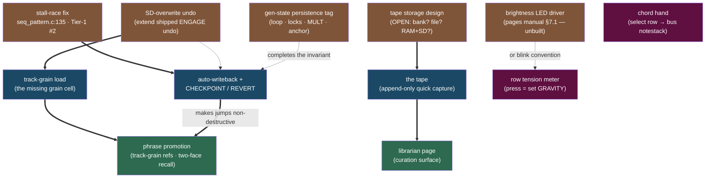
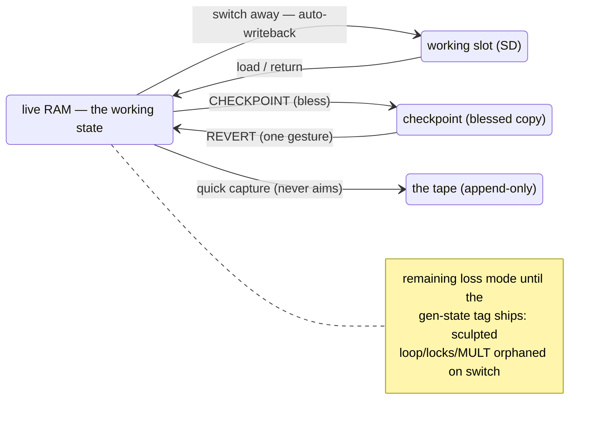
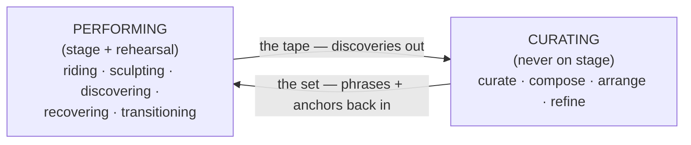
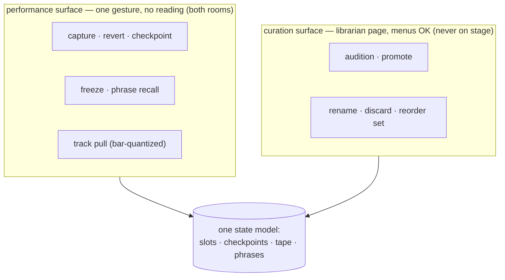
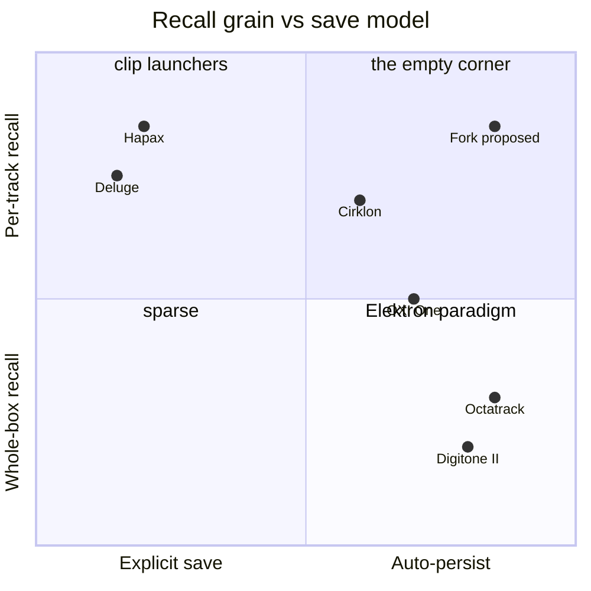

# Plan — Save model, groups, and the performing/curating reframe

**Date:** 2026-06-11 · **Status:** DISCUSSION ONLY — no code; nothing logged in §9 yet.
This file absorbs the 2026-06-11 handoff and adds (a) source verification of its repo
claims and (b) the decision visuals. Delete once contents are executed or logged into
design doc §9/§10 (§8 of this file lists the exact edits to make on adoption).

**To resume cold:** read design doc §5/§6/§9, pages manual §7, REFERENCE §2 (Tension
Workbench), the 2026-06-07 freeze-faithfulness handoff, then this file. Verified
against main at `d4e0f68`.

**Status labels:** DECIDED = user-confirmed direction. PROPOSED = Claude's analysis,
unchallenged but not blessed. OPEN = unresolved fork.

---

## 1. Decision dashboard

| # | Decision | Status | What it overturns / touches | Gate |
|---|----------|--------|------------------------------|------|
| D1 | **Invert the save model** — working state always persists (auto-writeback on switch); protection becomes the explicit act (CHECKPOINT/REVERT) | direction **DECIDED** + **§9-logged 2026-06-11**, mechanism PROPOSED | Reverses design §6 "Save/recall (intentional)" lose-on-switch clause (dated note placed). *Keeps* recall = relaunch/regenerate | Bless mechanism |
| D2 | **CHECKPOINT / REVERT** protection verbs | **DECIDED 2026-06-11** + **§9-logged** | New performance-surface vocabulary; storage fork OPEN (record pair vs parallel bank — §3.5 delta 9) | Mechanism design: storage + grain under organism-primary (group vs track vs whole-organism) |
| D3 | **Groups leave the performer model — organism-primary, no grid on stage** (sharpened from "demoted to shelving" after the clips/scenes challenge; see §10) | **DECIDED 2026-06-11**, sharpened same day + **§9-logged** | Softens §6 "Concurrency = 4 group-states" (dated notes placed; switching stays group-grain, *recall* grain = track); grid-shaped thinking quarantined to the curation surface | Build via RECOMBINE bundle (pull = transfusion, not launch) |
| D4 | **Phrase mode is the scene system** — phrases of track-grain refs; no DAW-ish song depth | direction **DECIDED** + **§9-logged 2026-06-11**, specifics PROPOSED | Reverses §9 "no new macro features" (dated notes placed); "organism = a phrase" | Format fork (§7); phrases pin CHECKPOINTed states (§9.2) |
| D5 | **The tape** — append-only session capture replaces §5.5 CAP_NNN quick-capture | **DECIDED 2026-06-11** + **§9-logged**; §5.5 supersession placed | Supersedes §5.5 (wrap-oldest withdrawn; bank-full-refuse stays only for *aimed* gestures) | Storage fork (§7) |
| D6 | **Performing vs curating** — one state model, two surfaces; sorting rule for every verb | direction **DECIDED 2026-06-11** (the organism-primary blessing makes the split load-bearing — the grid lives only on the curation surface); sorting rule verify-by-use | Frames all future verb design (performance bar vs curation bar) | Verify by use |
| D7 | **Row as touchable tension meter** (press = set GRAVITY) | **DECIDED 2026-06-11** (direction) + **§9-logged** | Blink convention vs §7.1 brightness driver decided at build; GRAVITY-page row currently does stock track-select (§3.5 delta 7) | TERRAIN-HANDS bundle, by ear |
| D8 | **Chord hand** — select row writes the bus notestack | **DECIDED 2026-06-11** (direction) + **§9-logged** | Closes the named "Cross-bus chord workflow (no UI yet)" gap | TERRAIN-HANDS bundle, by ear |
| D9 | **Invariants**: faithfulness (heard = saved) + deterministic returnability survive ANY re-envisioning | **DECIDED** | The north-star guard for D1–D8 | — |
| D10 | **Build order** across all of the above | **DECIDED 2026-06-11: RECOMBINE first** (track-grain load + pull gesture; licenses the SD-overwrite undo keystone) | — | Gesture design + census handling per §3.4; build waits for the D3 model comparison to settle |

---

## 2. The save-model inversion (D1/D2) — the core argument

**User's words (the reversal):** the stock lose-on-switch model "makes sense if you
want to meticulously save everything… but that's tedious and leads to constant
losses." The PATTERN-hold model "is more useful because it's auto saved there." →
"rethink the entire model."

**The invariant both models serve:** *"I can always get back to a state I cared
about."* Manual-save implements it by making disk immutable-by-default, and fails
because the protection costs a gesture exactly when attention is zero — the loss mode
is the default path. Inversion: **the working state always persists; protection
becomes the explicit act.**

**Proposed mechanism (Elektron-shaped):**
- Per-group dirty flag (chokepoints: `SEQ_PAR_Set` / `SEQ_TRG_Set` / `SEQ_CC_Set` —
  same instrumentation pattern as render-touched).
- Auto-writeback: in `SEQ_PATTERN_Handler`, if outgoing group dirty →
  `SEQ_PATTERN_Save` before loading the incoming pattern.
- **CHECKPOINT** (bless current slot contents as anchor) and **REVERT** (one gesture
  back to anchor). Jam-freely relocates: you jam the working copy *knowing* the
  checkpoint holds.
- Untouched: two-face recall model (writeback persists source+posture; capture stays
  the tape face; recall still relaunches), PATTERN-hold gesture.

**Costs / preconditions (honest, updated by §3.5):**
1. Switch path becomes SD write+read inside the handler window — stall-race fix
   (Tier-1 #2) and a widened `seq_core_pattern_switch_margin_ms` are preconditions
   (delta 1).
2. Power-loss mid-write on in-place fixed records: same exposure as today, higher
   frequency. Checkpoints partially mitigate (blessed copy = separate write).
3. Checkpoint storage: record-pair doubling does NOT fit existing banks (delta 9) —
   parallel checkpoint bank, or new banks.
4. **Generator-state orphan becomes THE remaining loss mode** — auto-writeback
   without Turing loop/lock/MULT persistence still loses the sculpted loop on switch
   unless bounced. Force-promotes the gen-state extension tag (the V3 ext-block infra
   is the proven carrier).

---

## 3. The build-order picture (decision visuals)

### 3.1 Dependency graph

Brown = infrastructure (licensed by bundles, §2.7). Blue = musical verbs. Green =
surfaces. Purple = independent play. Solid arrow = hard precondition; dashed = soft.

### 3.2 Candidate first bundles (§2.7: the unit of validation is a playable loop)

| Bundle | The playable loop at GO | New verbs | Infra licensed | Hard preconditions | Main risk |
|--------|------------------------|-----------|----------------|--------------------|-----------|
| **RECOMBINE** | pull Tuesday's kick under tonight's bass, bar-aligned, live | track-grain load + pull gesture | **SD-overwrite undo** (the keystone — extends shipped ENGAGE undo) | none | group-load side-effects must be translated per-track (§3.4 census — all mechanical) |
| **FEARLESS SWITCHING** | jam, switch, come back: nothing lost; REVERT to anchor | auto-writeback, CHECKPOINT, REVERT | stall-race fix (Tier-1 #2); checkpoint storage | stall-race fix; gen-state tag to close the last loss mode | switch latency = SD write+read in the handler window; power-loss frequency |
| **THE TAPE** | spam captures mid-jam, zero aiming; audit tomorrow | quick capture (append-only) | tape storage design | storage decision (OPEN) | supersedes §5.5 — needs the dated supersession |
| **PHRASE SET** | navigate a set of phrases fearlessly; rig follows | phrase recall (two-face), row LEDs | MBSEQ_S.V4 record-version bump | FEARLESS + RECOMBINE | format churn |
| **TERRAIN HANDS** | play chords into GRAVITY; touch the tension meter | chord hand; row tension meter | blink convention (or brightness driver) | none | row-mode ownership rule; GRAVITY-page row currently = stock track-select |

**Recommendation (PROPOSED): RECOMBINE first.** Smallest preconditions, most musical
new verb, licenses the keystone undo that every later destructive verb reuses, and it
tests the §5 hypothesis (group pain = compose-time recombination) by use instead of
by argument. TERRAIN HANDS is the orthogonal pure-music bundle — runnable anytime,
including as a palate cleanser between save-model rounds. FEARLESS SWITCHING is the
biggest conceptual payoff but carries the heaviest preconditions; the stall-race fix
gets licensed the moment it's chosen.

### 3.3 Save-model state flow (D1/D2/D5 in one picture)

Today's model has only the SLOT→LIVE arrow plus *aimed* capture; everything else on
the left dies on switch. The inversion adds the LIVE→SLOT default arrow and makes
ANCHOR the deliberate act.

### 3.4 The grain table + group-coupling census

|  | **save** | **load** |
|---|---------|----------|
| **track-grain** | ✅ PATTERN-hold (`SEQ_CORE_CaptureToSlotTrack`) | ❌ **the missing cell** |
| **group-grain** | ✅ `SEQ_PATTERN_Save` | ✅ `SEQ_PATTERN_Change`/`Load` |

You can put any track anywhere but only get them back four at a time — this asymmetry
is probably most of the "groups never fit my brain" pain. `LoadTrackFromSlot` is the
mirror of `CaptureToSlotTrack`: read record, copy one track's section into live, run
the slot syncs, `ManualSynchToMeasure(1 << track)` for a bar-aligned drop.

**Census of group-of-4 couplings (verified 2026-06-11 — the handoff's "exactly five
places" was refuted; see §3.5 delta 2):**

| Coupling | Where | Track-grain load must… |
|----------|-------|------------------------|
| `seq_pattern[4]` + 4-track fan-out | seq_pattern.c / seq_file_b.c | read one track's section instead (mechanical) |
| bank record packing (`num_tracks`, "usually 4") | seq_file_b.c per-pattern header | index within record (mechanical) |
| song-mode steps | seq_song.c | untouched (phrase work owns this) |
| pattern-page UI + fork capture semantics | seq_ui_pattern.c / seq_ui.c | gesture design (§7) |
| sustain-cancel + PC/bank send on load | seq_pattern.c post-load fan | per-track variants already exist |
| UNMUTE_ON_PATTERN_CHANGE nibble `0xf << 4*group` | seq_pattern.c | one bit instead of nibble |
| RATOPC nibble (same mask, 2 sites) | seq_pattern.c:231, seq_song.c:285 | one bit (`reset_trkpos_req` is already a track mask) |
| mixer-map coupling (group*4 channels) | SEQ_PATTERN_Handler | **skip** deliberately |
| section-changer bus (group-wide `play_section`) | seq_midi_in.c ~889 | untouched |
| ext-ctrl PC fans all 4 groups | seq_midi_in.c ~1125 | untouched |
| MIDI-export Group mode; session bank↔group identity | seq_midexp.c; seq_file.c:370 | untouched |

Conclusion intact: the *load path* couplings are all mechanical to translate, and the
tick/render/processor/bus spine stays flat-16. But the verb must handle each row
above *deliberately* — silence here is how the cross-group gesture bought five bugs.

**Display honesty:** after a track-grain load, `seq_pattern[group]` no longer
describes what's playing. Per-track provenance is cosmetic and goes stale on edit —
cheap to show, fine to skip in v1, but the LCD must not lie.

### 3.5 What source verification changed (2026-06-11, at `d4e0f68`)

1. **Tier-1 #2 is a *missing* stall, not a stalling sequencer.** The seq_pattern.c:135
   TODO sits in `SEQ_PATTERN_Change`'s deferred branch: a new request silently
   overwrites a pending unserviced `seq_pattern_req[group]`. The SD blocking is
   separate: `SEQ_PATTERN_Handler` runs the whole read inside `portENTER_CRITICAL()`
   (a ">65 mS" stopwatch warning exists), covered by pre-generated ticks
   (`SEQ_CORE_AddForwardDelay(seq_core_pattern_switch_margin_ms)`). Auto-writeback
   implications: the margin must cover write+read; the handler runs from **three**
   places (1ms task, synched point in `SEQ_CORE_Handler`, midexp) and the writeback
   hook must behave in all three. Softer than the handoff feared: requests are
   per-group, so an overwritten request loses only an intermediate switch *target*;
   writeback still fires once at service time.
2. **"Group boundary in exactly five places" — refuted.** Full census in §3.4. The
   grain-table conclusion stands, but track-grain load has ~8 side-effect rows to
   handle deliberately, not zero. Bycatch: seq_file_s.c:351 clamps
   `seq_song_guide_track` against `SEQ_CORE_NUM_GROUPS` (4) where the comment says
   0..16 — guide tracks 5–16 silently zeroed on song load; latent upstream bug,
   logged in TODO triage.
3. **One-deep undo is half-shipped.** ENGAGE auto-undo is specified in design §3 and
   BUILT (1026 B in CCM). The missing piece — flagged in §9 as the follow-on — is
   undo for **SD slot overwrite** ("No UNDO snapshot yet", seq_core.c ~1488). The
   keystone is an *extension of a shipped pattern*, not a new build. Budget verified:
   CCM 52.9/64 KB (~11.1 KB free); main SRAM ~32 KB free (incl. MSP tail, 592 B
   measured peak). Track-grain victim ~1.3 KB+CCs fits anywhere; group-grain ~6 KB
   fits CCM.
4. **CAP_NNN: absent in code, alive in the spec.** §5.5 *specifies* it (SAVE
   single-press, wrap-oldest). The tape supersedes a decided spec, not an idea —
   adoption requires a dated §5.5 supersession note.
5. **Capture storage facts that shape the tape fork.** Captures are ordinary pattern
   slots in the group's own bank (no dedicated file); each group navigates only its
   own bank (bank-change `#if 0`'d); bank↔group identity is hard-wired at
   session-format time (`SEQ_FILE_Format`). A "dedicated tape bank" breaks that
   identity; a session file or RAM+SD journal doesn't.
6. **Phrase carrier is friendlier than feared.** MBSEQ_S.V4 mirrors the bank scheme
   (24-byte header: name + `num_songs` u16 + `song_size` u16; fixed-size records) —
   `song_size` is already parameterized, so track-grain refs can ride a
   record-version bump, same trick as the bank ext-tag. Song action vocabulary
   verified from source: Stop/End, Loop1..16, JmpPos/JmpSong, SelMixerMap, Tempo,
   Mutes, GuideTrack, UnmuteAll — the arrangement tooling worth keeping is all there.
7. **GRAVITY-page select row isn't free — it's stock.** The row does global
   track-select there (that *is* the per-track GRIP edit path: pick track, turn GP3);
   GP4 enc duplicates track select, so repurposing the row is viable at the cost of
   one-press track pick on that page. REFERENCE updated to record GP4.
8. **Chord hand lands on solid engine ground.** `bus_notestack[4][…]` exists;
   `SEQ_MIDI_IN_BusPCSetGet` returns the 12-bit pitch-class mask read by CHORD_MASK
   *and* TENSION; `SEQ_MIDI_IN_BusLowestNoteGet` is the GRAVITY root proxy. Zero UI
   writers anywhere in seq_ui_*.c — the gap is exactly as named.
9. **Checkpoint-pair storage won't fit existing banks.** `num_tracks` lives in the
   per-PATTERN header; the bank header carries `pattern_size`. Doubling the record
   means doubling `pattern_size` at Create time — existing banks lack 2× slack
   (par/trg layers dominate). Checkpoint-pairing implies new banks, or take the
   parallel-checkpoint-bank option.

---

## 4. Scenario anatomy (PROPOSED — user did not correct; verify by use)

**Live set = five recurring situations cycled all night:** riding (prepared material,
bar-quantized, eyes up) · sculpting (GRAVITY/masks/mutation/window/mutes) ·
discovering (the box finds something better — keep it without breaking flow) ·
recovering (one gesture back to solid ground) · transitioning (performed, not dead
bars).
**Requirements:** discovery never lost (≤1 gesture, zero aiming, never blocks, never
overwrites) · never stranded (one gesture to an anchor) · bounded surprise
(undo/FREEZE/REVERT cap blast radius) · transitions playable · **nothing requires
reading** (LCD confirms, doesn't navigate).

**Writing/building = six activities:** generate volume (judgment off, capture spam) ·
curate (morning-after: audition, promote, name, discard) · compose (recombination —
Tuesday's kick + that bass + new lead; **track-grain load is THE verb here**) ·
arrange (order states, attach rig setup, design transitions) · refine (step-level
depth the box always had) · rehearse (play as-if-live, loop discoveries back without
transcription).
**Requirements:** cheap divergence · free recombination · organization that doesn't
rot · fast rehearsal loopback.

**The reframe (PROPOSED, load-bearing):** the real division is not live vs studio —
rehearsal IS performing; discovery happens alone too. It's **performing vs curating**.
Performing happens in both rooms; curating never happens on stage.

Faithfulness (heard = saved) is what makes the cycle trustworthy in both directions.

**One state model, two surfaces:**

**Sorting rule for every verb:** needed by both contexts → must meet the performance
bar (one gesture, no reading). Needed only by curation → may afford menus.
Track-grain load is born a composition verb — design once, expose on both surfaces
(live variant = bar-quantized pull).

**Context differences, compressed:** attention (zero vs abundant) · time
(forward-only vs revisitable) · judgment (deferred vs the entire activity) ·
organization (consumed vs produced) · failure cost (audience vs none) · granularity
(states/gestures vs tracks/steps).

---

## 5. Phrase mode is the scene system (D4 — direction DECIDED)

**User confirmed:** the box prepares *performable material whose final form only
exists in the room* — NOT end-to-end compositions. Not a song-mode person, but phrase
mode "always seemed brilliant"; uses it for rig setup at a phrase, program changes,
manual stepping. → Song mode does NOT grow linear DAW-ish depth; everything stays
phrase-centric; effort goes to the tape + the librarian instead.

**Promotion plan (PROPOSED specifics on the DECIDED direction):**
- Phrases reference **track-grain** states instead of per-group patterns (carrier:
  MBSEQ_S.V4 record-version bump — §3.5 delta 6).
- Phrase recall gets two-face semantics: tap = posture, FREEZE-held = tape. Zero new
  mode, mirrors §5.5.
- Row LEDs show phrase state: current / cued / dirty.
- The song action vocabulary survives intact (verified, delta 6) — it's genuinely
  good arrangement tooling.
- D1's auto-writeback makes phrase jumps non-destructive — removes the last reason to
  fear navigating your own set.
- Scene system (option B from the groups discussion) is **dissolved into this** — a
  phrase IS the scene.
- **Phrases reference CHECKPOINTed states, not working slots** (candidate principle
  from §9.2: under auto-persist, assignment references drift — Hapax's documented
  weakness, solved Cirklon-style by anchoring to committed versions).

---

## 6. Hardware UX (PROPOSED, still live)

- **Second row as touchable visualization (D7):** mirror `tension_meter` to the 16
  LEDs — bipolar, detent between LED 8/9, fill outward; **press = set GRAVITY at that
  position** (legal: manual turns already abort RESOLVE and jump instantly; 16
  positions ≈ zone granularity — the isolator-throw gesture). Cost: zone-boundary
  ticks need the unbuilt brightness driver (pages manual §7.1) or a blink convention;
  and the GRAVITY-page row currently does stock track-select (GP4 enc covers it —
  delta 7).
- **Second row as the chord hand (D8):** select-row chord/keyboard mode writing the
  bus notestack — closes the "Cross-bus chord workflow (no UI yet)" gap; makes the
  GRAVITY ladder's chord zone performable from the box. SHADE-aware scale-degree
  mapping (the row always plays the current terrain). Buttons are velocity-less
  (accent modifier if needed).
- Drum pads = trigger/record surface only; drum pitch stays fenced "until drum pitch
  gets its own design pass."
- **Row-mode ownership rule:** page-scoped or held-modifier, never a free-floating
  global toggle (no hidden mode state — same principle as the destination control).
  Precedent: PATTERN-hold intercepts the row only while held.

---

## 7. Open forks queued for the user

1. ~~**First bundle** (D10)~~ — **ANSWERED 2026-06-11: RECOMBINE** (the recommended
   pick).
2. ~~**Group-pain locus**~~ — **ANSWERED 2026-06-11: conceptual overhead** — the
   group boundary itself costs attention (not recall grain, not browsing per se).
   User is "not 100% sure" and asked to discuss other models first: how does this
   differ from the **Hapax**? the **Digitone II**? → §9 model comparison.
3. **Tape storage:** session file / RAM+SD journal / dedicated bank (delta 5 argues
   against the bank). Is the librarian page just a tape browser + promote verb?
4. **Checkpoint storage:** parallel checkpoint bank vs record-pair-in-new-banks
   (delta 9 says existing banks can't pair).
5. **Gen-state extension tag scope** (loop array / locks / MULT / anchor) — forced by
   D1.
6. **Gesture for track-grain pull** (symmetry candidate: hold track button + aim,
   mirroring PATTERN-hold push). Don't overdesign before the verb exists.
7. **Phrase format:** extension tag in MBSEQ_S.V4 vs new file (delta 6 favors the
   record-version bump).
8. **Performance fence for auto-writeback** (new, from §9.2 / DN2's PERFORM KIT
   lesson): is a live processor sweep mid-transition *editing the state* or
   *playing the moment*? Decide whether CHECKPOINT/REVERT + the shaping/generative
   axis distinction already covers this, or whether writeback needs a
   don't-commit-my-performance mode.

---

## 8. When adopted — exact design-doc edits (so execution is mechanical)

1. ~~§9 new dated block~~ — **EXECUTED 2026-06-11** ("2026-06-11 — Save model,
   groups, phrases" block; §6 "Save/recall (intentional)" carries the dated
   reversal note; recall = relaunch/regenerate recorded as surviving).
2. ~~§9 groups entry~~ — **EXECUTED 2026-06-11** (dated notes at §6 Concurrency
   bullet + §9 spine bullet).
3. ~~§9 organism-=-phrase entry~~ — **EXECUTED 2026-06-11** (dated notes at §5
   skeleton bullet + §9 "Set-density" spine bullet).
4. ~~§5.5 dated supersession~~ — **EXECUTED 2026-06-11** (D5 blessed; supersession
   note at the §5.5 quick-capture bullet + the §9 spine bullet; tape entry added
   to the §9 2026-06-11 block).
5. ~~§10 open questions~~ — **EXECUTED 2026-06-11** ("Save-model rethink" block
   added before Design-detail).

---

## 9. Model comparison — Hapax · Digitone II · Cirklon · Octatrack · Deluge · OXI One
*(researched 2026-06-11, manual-verified with cited sources; full fact sheets in the
session research outputs. Requested by the user to settle D3: "how does this differ
from the Hapax? what about the Digitone 2?" — plus Cirklon by request.)*

### 9.1 The map

Two axes organize the whole space: **recall grain** (what switches together) and
**save model** (what survives without a gesture).

| | Recall grain | Scene layer | Save model | Checkpoint / revert | Take capture |
|---|---|---|---|---|---|
| **Hapax** | per-track (16 pat/track, independent switch) | sections = snapshot of per-track *assignments*; chained into song | explicit, project-grain, **no autosave** | Snapshot A/B per pattern; **undo cleared on pattern change** | none |
| **Digitone II** | whole-box (8 banks × 16; all 16 tracks switch together) | none (songs reference pattern slots) | auto-persist **into RAM**; explicit commit to +Drive | temp-save / reload per pattern ([FUNC]+[YES]/[NO]) | none |
| **Octatrack** | whole-box + silent Part binding | 16 crossfader scenes *inside* each Part | auto-persist; explicit Part/project saves = checkpoints | **Reload Part** — one gesture, refuses until checkpointed | none |
| **Cirklon** | per-track material; whole-box scenes | scenes = assignments + initial mutes + xpose/FTS/GBAR; song = scene list | battery RAM auto-persists **everything**; explicit versioned commit (save / save-as / skip / lose per dirty pattern) | recall-saved, undo-edits, recall-workscene | **workscene SAVE = append take as new scene** |
| **Deluge** | per-track clips | sections + arranger timeline | explicit file saves; lettered sub-slots as manual variants | none (the documented cost) | arranger live-record |
| **OXI One** | **per-sequencer group of 4** | song steps per lane | hybrid: autosave + 20 explicit slots | none | none |
| **This fork (proposed)** | per-track load + group switch on a flat-16 spine | phrases = track-grain refs + mutes | **SD auto-writeback** (working store *is* durable store) | CHECKPOINT/REVERT + SD-overwrite undo | the tape (append-only) |

### 9.2 The load-bearing findings

- **"Elektron-shaped" needed precision (D1).** Elektron auto-persists into *RAM
  working state only*; storage commit stays explicit (project save / SAVE TO PROJ).
  Every auto-persist box's lost-work stories live in the **seam between working
  store and durable store**: DN2's stale +Drive copy, Octatrack's Save-vs-Sync-to-
  Card ambiguity ("ate a year of work"), Cirklon's dead-battery wipes (community
  doctrine: ritual SD backups). Our proposal **collapses that seam** — the working
  store is the SD slot itself. Cost: write frequency and power-loss-mid-write
  (checkpoints mitigate); benefit: the entire class of stale-copy losses cannot
  exist. This is an argument *for* the writeback shape no other box has.
- **DN2's PERFORM KIT mode is a warning about auto-writeback.** Performers needed a
  dedicated mode to *stop* live tweaks being committed on pattern switch ("without…
  inadvertently saving your kit"). Our analog: sweep GRAVITY mid-transition — is
  that *editing the state* or *playing the moment*? New fork (§7 #8): does
  auto-writeback need a performance fence, or are CHECKPOINT/REVERT + the
  shaping/generative axis distinction enough?
- **References drift under auto-persist — phrases must pin anchors.** Hapax
  sections store *assignments*, and content drift is invisible. Cirklon solves it
  with save-as **versioning at commit** (scenes end up referencing specific
  pattern versions). Under our inverted model the same hazard appears: a phrase
  referencing a *working slot* changes meaning every time you jam on that slot.
  Derived design constraint (candidate principle): **phrases reference
  CHECKPOINTed states, not working slots** — phrase recall is anchor recall.
  This adds a soft CHECKPOINT → phrase-promotion dependency to the §3.1 graph.
- **The Cirklon workscene validates the tape, exactly.** Jam in a scratch scene,
  hit SAVE whenever it sounds good, each save *appends* the state to the song with
  auto-named incremental versions — "the song assembles itself from your takes"
  (lineage: Dr. T's KCS). That is the tape + promote flow with thirty years of
  field testing behind it. Praised specifically by live users.
- **Hapax's complaint list reads as our requirements list.** Sections ride a menu
  encoder (→ our performance-bar rule); FREE-trig patterns launch mid-phrase from
  sections (→ our bar-quantized pull + two-face recall); **undo cleared on pattern
  change** makes destructive edits irreversible mid-set (→ our SD-overwrite undo
  snapshots victims, surviving switches by construction); no autosave (→ D1).
- **Octatrack's lesson, both directions.** Reload-Part is the proof that
  auto-persist + explicit checkpoint + one-gesture revert is "the performance-
  winning combination" — and its most-hated trait is the *silent Part swap bound
  to pattern recall*. Lesson: never couple hidden state to a recall verb. Our
  two-face recall keeps the face choice explicit (FREEZE-held) — keep it that way.
- **Torso T-1's TEMP button** — hold-to-deviate, release-is-revert. Checkpoint by
  gesture, no save verb at all. Not needed for the save model, but a beautiful
  candidate gesture for processor sweeps (hold TEMP + sweep GRAVITY, release snaps
  back). Parked for the workbench.

### 9.3 The groups answer (D3)

Across all six boxes, **nobody recalls in groups of 4 — except the OXI One**, and
there the boundary is *semantic*: each of its 4 sequencers is a different machine
type, so the grain aligns with something the performer already thinks about. The
general law the comparison suggests: **a grain boundary earns its conceptual cost
only when it aligns with a musical concept** (Hapax/Deluge: the track/instrument;
Elektron: the whole groove; Cirklon scenes: the song moment; OXI: the engine).
MBSEQ's 4×4 aligns with *storage packing* — which is precisely why it reads as
pure overhead ("remembering what's bound to what"). The user's instinct is the
finding.

Cirklon's counter-lesson keeps us honest: even a *good* model costs concepts when
it multiplies object kinds (song/scene/workscene/pattern-version confuse every
newcomer). Our full proposal carries: track · slot · checkpoint · tape · phrase ·
group-as-shelf. The D6 two-surface split is what makes that affordable — the
**performance surface only needs four nouns** (track, phrase, capture, revert);
the librarian carries the rest. That is a stronger answer to "conceptual overhead"
than any single-model copy would be.

**Recommendation, sharpened: D3 stands (demote groups to shelving), and the
comparison shows the proposed corner — per-track recall grain + working-store-is-
durable-store — is empty because it requires the storage layer this fork already
has (versioned per-track ext-blocks, slot banks), not because it's undesirable.
Every neighbor's praised half points into it; every neighbor's complaint list maps
onto something this design already decided differently.**

---

## 10. D3 sharpened — organism-primary, no grid on stage (2026-06-11, user-blessed)

**The challenge (user):** does D3 just perpetuate the disliked mental model? "My
current mental model is Ableton clips and scenes; Hapax is similar." The worry:
track-grain load ≈ clip launch, phrases ≈ scenes — D3 risks rebuilding session
view on hardware.

**The resolution:** the question is *what's primary — the grid or the running
state*. Clips/scenes commits to grid-primary: material lives in a (track, slot)
grid, performing = launching/navigating prepared material, states are dead tapes.
This design, said out loud, is the **inversion**:

| Clips/scenes (Ableton, Hapax) | This design |
|---|---|
| The grid is the instrument; live state ephemeral | **The live 16 tracks are the organism**; storage is its memory |
| Performing = launching/navigating | Performing = **sculpting the running state** |
| States are dead tapes | States are **two-faced** — tape *and* posture (spring) |
| Record into the grid (aiming required) | Discovery sheds into **the tape** — append-only, never aimed |
| Scenes = rows you walk | **Phrases = waypoints** — sparse anchors the organism evolves between |
| Safety = don't touch the saved clip | Safety = **CHECKPOINT/REVERT** on the living state |

**The blessed articulation:** on the performance surface the model is four nouns —
the **organism** (live 16 tracks), the **tape**, the **anchor**, the **waypoint**.
No grid, no groups. **A set is a path, not a grid.** Grid-shaped thinking is
quarantined to the curation surface (the librarian), where it is the right tool —
that is what D6's two-surface split is *for*.

**Supporting facts:**
- The storage already *is* a 16×64 clip grid under re-projection: 4 banks × 64
  patterns × 4 track-sections = 16 per-track columns × 64 slots; each section
  carries its own 80-char name (`seq_file_b_track_t.name`), and
  `SEQ_CORE_CaptureToSlotTrack` already writes single sections (load-modify-save,
  preserving the other 3). The librarian's grid view is nearly free; the decision
  was only ever whether the *performer* must think in it.
- The **posture-face pull** is the escape hatch from clip-ness no launcher has:
  pulling a stored track as *tape* is an Ableton move; pulling it as a *spring*
  (posture relaunches, evolves differently tonight) has no session-view analog.
  The grid stores springs, not corpses.

**Consequences:**
- RECOMBINE's pull verb is a **transfusion into the organism**, not a launch —
  born a composition verb (curation room / rehearsal), live variant bar-quantized.
  Destination follows the standing cursor-aware rule (deliberate placement wins,
  no smart-default jumps). Two-face choice at pull time (tap = posture,
  FREEZE-held = tape), mirroring recall semantics. Don't overdesign before the
  verb exists.
- D6's direction is effectively decided (the split carries the articulation); its
  verb-sorting rule still gets verified by use.
- Design doc §9 2026-06-11 block carries the dated refinement bullet.
